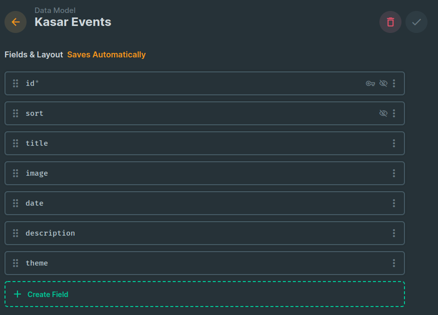

# Kasar website

Pour faire l'installation du site, il faut :
- Installer Directus ([Docker](https://hub.docker.com/r/directus/directus/#!) ou [NodeJs](https://docs.directus.io/self-hosted/installation/cli/))
- Créer un modèle intitulé : `kasar_events` avec les champs qui suivent :

- Remplir les datas avec les anciennes si vous voulez `kasar_events 2022-06-16 at 15.22.23.json`
- Faire fonctionner directus sur un sous domaine ou un domaine (avec le https).
- Ensuite, il faut [Node Js V.16](https://nodejs.org/en/download/) (la V.18 ne fonctionne pas avec le front, vous pourrez corriger)
- Puis git clone de ce repo, changer dans `index.js` la variable constante `const API_URL` par 
```javascript
const API_URL = domaine_directus + "/items/"
```
- Lancer NextJs avec 
```bash
npm run build
npm run start
```
PS: je vous conseille __pnpm__ au lieu de __npm__
